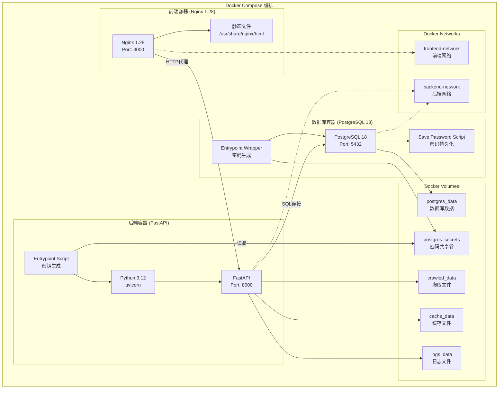

# MNR Law Crawler - 数据流图表 (Mermaid版本)

> 如果您的Markdown查看器支持Mermaid图表，可以直接查看可视化流程图

## 系统整体架构

```mermaid
graph TB
    subgraph 前端层["前端层 (Vue 3 + TypeScript)"]
        A1[Policies.vue]
        A2[Tasks.vue]
        A3[Settings.vue]
        A4[Login.vue]
        A5[API Client<br/>axios]
        A1 --> A5
        A2 --> A5
        A3 --> A5
        A4 --> A5
    end
    
    subgraph API层["API 路由层 (FastAPI)"]
        B1[/api/auth]
        B2[/api/tasks]
        B3[/api/policies]
        B4[/api/config]
        B5[认证中间件<br/>JWT验证]
        B1 --> B5
        B2 --> B5
        B3 --> B5
        B4 --> B5
    end
    
    subgraph 服务层["业务服务层 (Services)"]
        C1[AuthService]
        C2[TaskService]
        C3[PolicyService]
        C4[ConfigService]
        C5[StorageService]
        C6[CacheService]
    end
    
    subgraph 核心层["核心爬虫层 (Core)"]
        D1[PolicyCrawler]
        D2[MNRSpider]
        D3[APIClient]
        D4[HTML Parsers]
        D5[Config]
        D1 --> D2
        D1 --> D3
        D2 --> D4
        D2 --> D5
    end
    
    subgraph 存储层["数据存储层"]
        E1[(PostgreSQL<br/>Database)]
        E2[本地文件系统]
        E3[S3对象存储<br/>可选]
    end
    
    subgraph 外部["外部数据源"]
        F1[政府信息公开平台<br/>gi.mnr.gov.cn]
        F2[政策法规库<br/>f.mnr.gov.cn]
    end
    
    A5 -->|HTTP/JSON| B1
    A5 -->|HTTP/JSON| B2
    A5 -->|HTTP/JSON| B3
    A5 -->|HTTP/JSON| B4
    
    B1 --> C1
    B2 --> C2
    B3 --> C3
    B4 --> C4
    
    C2 --> D1
    C3 --> C5
    C4 --> E1
    C5 --> C6
    C5 --> E2
    C5 --> E3
    
    D3 -->|HTTP请求| F1
    D3 -->|HTTP请求| F2
    
    C1 --> E1
    C2 --> E1
    C3 --> E1
    C2 --> E2
    C3 --> E2
```

## 任务创建与执行流程


## 政策查询流程


## 用户认证流程


## 配置管理流程


## 文件下载流程


## 数据模型关系图


## 爬虫执行详细流程


## 配置加载流程


## Docker 容器架构



## Docker 自动配置流程


---

*最后更新: 2025-12-09*

*这些图表展示了MNR Law Crawler系统的完整数据流和Docker容器架构。建议在支持Mermaid的Markdown查看器中查看以获得最佳可视化效果。*

